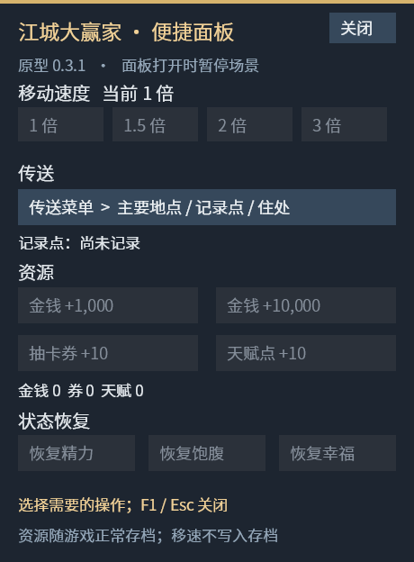
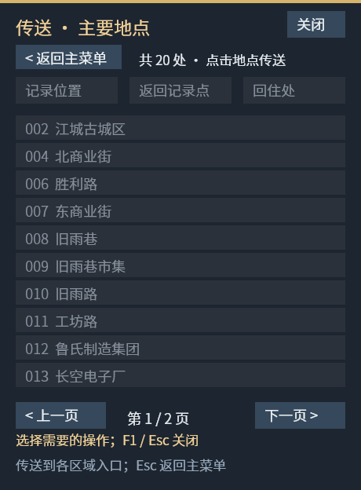
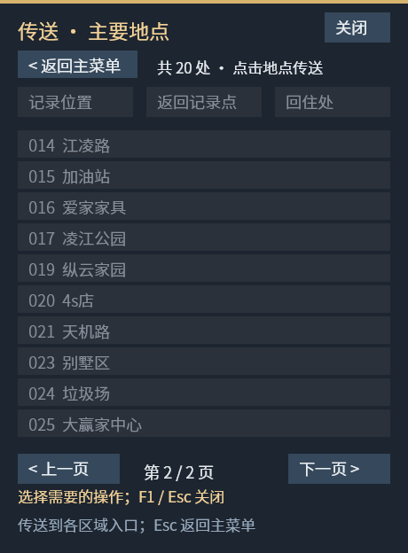

# 江城大赢家便捷 Mod

《江城大赢家 / Big Winner》Windows 版的非官方便捷 Mod，提供中文小面板、玩家移速调整、主要地点传送、资源和状态恢复，以及打牌时整手换牌。

**当前版本：v0.3.1。** 需要已安装并能正常运行的正版游戏；本项目不包含游戏本体、游戏 DLL、字体、音频或存档。

## 下载与安装

1. 打开 [Releases 下载页](https://github.com/cod919/big-winner-mod/releases/latest)，下载 **`BigWinnerMod-v0.3.1-win-x64.zip`**。GitHub 自动提供的 `Source code` 压缩包是源码，不是安装包。
2. 正常退出游戏。Steam 库中右键游戏 → **管理 → 浏览本地文件**，找到包含 `TheBigWinner.exe` 的目录。
3. 将安装包中的 **`Start-Mod.vbs`、`Start-Mod.ps1` 和 `BigWinnerMod` 文件夹**一起解压到该目录。不要放进 `Data` 或再套一层文件夹。
4. 保持 Steam 正常登录，双击游戏目录里的 **`Start-Mod.vbs`** 启动。这个入口不会显示命令行窗口。
5. 出现右上角 **`MOD [F1]`** 表示已加载。进入存档、关闭设置或背包等窗口后，按 **F1** 打开面板。

正确的目录结构：

```text
游戏安装目录/
├─ TheBigWinner.exe             ← 原游戏文件
├─ script.dll                  ← 原游戏文件
├─ iF2D.dll                    ← 原游戏文件
├─ 0Harmony.dll                ← 原游戏文件
├─ Start-Mod.vbs                ← 解压加入
├─ Start-Mod.ps1                ← 解压加入
└─ BigWinnerMod/
   ├─ maps.json
   ├─ README.zh-CN.md
   └─ release/
      ├─ BigWinnerMod.dll
      └─ BigWinnerMod.deps.json
```

**每次使用 Mod 都要从 `Start-Mod.vbs` 启动。直接从 Steam 或 `TheBigWinner.exe` 启动仍是原版，不会自动加载 Mod。** 可以为 `Start-Mod.vbs` 创建桌面快捷方式。

## 使用方法

| 功能 | 操作与效果 |
| --- | --- |
| 中文面板 | F1 或右上角 `MOD [F1]`；F1 / 关闭按钮关闭面板。打开时暂停场景。 |
| 玩家移速 | 1 / 1.5 / 2 / 3 倍；剧情和被脚本控制时不加速。重启后回到 1 倍。 |
| 地点传送 | 面板 → 传送菜单，20 个主要地点、2 页；点击名称传送到区域入口。支持翻页按钮、左右方向键和鼠标滚轮。 |
| 位置记录 | 传送菜单内记录当前位置、返回记录点、回住处。记录点仅本次运行有效，换存档清除。 |
| 增加资源 | 金钱 +1,000 / +10,000，票券 +10，天赋点 +10。金钱最多增加到 2 千万，避免原游戏存档整数溢出。 |
| 恢复状态 | 精力、饱腹恢复到上限；幸福度按当前市民等级恢复到 100%，不是永久锁定。 |
| 整手换牌 | 在“大赢家之战”允许操作因果牌时，点击右上角 **整手换牌 [F2]** 或按 **F2**。不需要打开 F1 面板。 |

传送页按 **Esc** 返回主菜单；主菜单按 **Esc** 关闭。地图传送、资源和状态修改在自由行走状态可用，剧情、转场或角色执行动作时会暂时不可用。

整手换牌遵循原生“熔炼”的换牌规则：从当前牌堆取出三张牌，把旧手牌放回牌堆末尾，更新原生牌型显示和动画。**不要求拥有熔炼、不消耗票券、不占用原生技能次数**；可间隔一秒重复使用。对方手牌和牌堆数量不变。

幸福度由娱乐、美食、舒适共同计算。恢复幸福只补足缺少的娱乐值，保留美食和舒适值。

### 20 个传送地点

- 第 1 页：江城古城区、北商业街、胜利路、东商业街、旧雨巷、旧雨巷市集、旧雨路、工坊路、鲁氏制造集团、长空电子厂。
- 第 2 页：江凌路、加油站、爱家家具、凌江公园、纵云家园、4s店、天机路、别墅区、垃圾场、大赢家中心。

只列出城市地图的主要区域，不列室内、测试、空白或剧情副本地图。

## 升级、停用与存档

- **升级**：退出游戏，将新版安装包解压到同一游戏目录，覆盖本 Mod 的同名文件。
- **停用**：退出后从 Steam 或 `TheBigWinner.exe` 启动原版。
- **卸载**：移除本安装包加入的两个 `Start-Mod` 文件和 `BigWinnerMod` 文件夹即可，不要删除原游戏文件。
- 资源、状态和当前位置会随着游戏自身存档保存。Mod 不会替你自动存档；停用 Mod 不会撤销已经保存的修改。建议先用单独的测试存档试用。

## 常见问题

**没有 `MOD [F1]`？**

确认是双击 `Start-Mod.vbs` 启动；检查上面的目录结构，尤其是 `BigWinnerMod/release/BigWinnerMod.dll`。退出已有游戏后再启动，避免仍在查看原版进程。

**按钮是灰色、F1 打不开或换牌按钮不出现？**

先关闭游戏原有设置、背包、对话等窗口。传送和状态修改需要进入存档并自由行走；F2 换牌入口仅在牌局允许操作因果牌的阶段出现。

**启动脚本或游戏报错？**

不要关闭系统安全功能。记录具体错误，并在 [Issues](https://github.com/cod919/big-winner-mod/issues) 反馈。脚本启动问题可在游戏目录右键 `Start-Mod.ps1` →“使用 PowerShell 运行”，查看提示；如果系统组织策略禁止运行脚本，需要按所在设备的管理要求处理。

**更新游戏后失效？**

本 Mod 依赖游戏内部接口，尤其是换牌部分的字段名，游戏更新后可能需要适配。请先用原版入口确认游戏正常，再反馈版本号和操作步骤。

运行日志位于 `BigWinnerMod/mod.log`。反馈时附上出错附近的少量日志即可，不需要上传存档、Steam 账号信息或整个游戏目录。菜单中的“抽卡券”为票券的暂用名称。

## 适配与验证范围

- 面向 Windows x64、iF2D / .NET 8 版《江城大赢家》。当前核对的游戏内部版本号为 **1.2.23.0929.1**，未承诺跨版本兼容。
- 编译通过；三个 Harmony 补丁入口经过独立进程检查。
- 已有实际游戏加载、面板使用和多次整手换牌日志；不代表每种牌局及所有存档状态均已验证。
- 20 个传送点经过地图静态碰撞检查，仍需在游戏里确认动态角色、家具与剧情触发的影响。
- 幸福度在 44 个市民等级的隔离状态下验证为 100%；重复恢复不继续增加数值。地图菜单两页和翻页边界经过后台绘图检查。

### 菜单预览

以下图片由游戏原有绘图代码在无存档的测试状态下生成，因此修改按钮显示为灰色。





## 从源码构建

普通玩家只需下载 Release 安装包，无需安装开发工具。开发者需要 [.NET 8 SDK](https://dotnet.microsoft.com/download/dotnet/8.0) 和本机游戏安装目录。

在仓库目录打开 PowerShell，运行：

```powershell
.\build.ps1 -GameDirectory '你的游戏安装目录'
```

输出：`artifacts/BigWinnerMod-v0.3.1-win-x64.zip`。构建只引用本机游戏目录中的依赖，不复制或上传这些游戏依赖。

源码位于 `src/`，启动器位于 `install/`，20 个地点的入口参数位于 `data/maps.json`。采用 [.NET StartupHook](https://github.com/dotnet/runtime/blob/main/docs/design/features/host-startup-hook.md) 加载，并使用游戏已有的 [Harmony](https://harmony.pardeike.net/) 进行方法补丁，不替换游戏原有 DLL。

本项目与游戏开发商及发行商无关联。游戏名称、资源和依赖库的权利归各自权利人所有。
